# [GBA] Castlevania - Aria of Sorrow - Tradução PT-BR

Este é um projeto de tradução do jogo Castlevania - Aria of Sorrow, de Gameboy Advance, para português do Brasil. O projeto foi iniciado na versão européia do jogo lá em 2008, mas foi posteriormente migrado para a versão americana.

Terceiro e último jogo da série castlevania lançado pra Gameboy Advance. Para uns é considerado o melhor jogo de castlevania feito para GBA, e um dos melhores da série. É bem parecido com o famoso "Symphony of the Night" de PS1.

# Informações

Nome do jogo: Castlevania - Aria of Sorrow

Versão: Americana

Plataforma: Gameboy Advance

Desenvolvedora: Konami

Distribuidora: Konami

Gênero: Plataforma / Metroidvania / RPG de Ação

Jogadores: 1

# Enredo

Diferente de todos os jogos de castlevania até então, esse é o primeiro onde os acontecimentos são no futuro e não no passado como antes. O ano dos acontecimentos desse jogo é 2035. O personagem principal se chama Soma Cruz. É um estudante que está fazendo intercâmbio, estudando no Japão.

Tudo começa quando no dia do primeiro eclipse solar do século XXI, Soma está indo até o templo de sua amiga de infância Mina Hakuba para ver o eclipse com ela. Ao chegar lá, depara-se com a escadaria antes do tempo, que já estava acostumado em subí-la para chegar ao templo.

Porém, estranhamente ele tem uma sensação ruim, como se fosse algo tentando evitar que ele se aproximasse do eclipse. Mesmo com essa sensação medonha a ponto de lhe causar um pouco de tontura, continuou indo em frente. Ao chegar ao topo, anormalmente ele perdeu a consciência. E quando acordou, deparou-se dentro do castelo do Drácula, junto de Mina e outra pessoa estranha.

Lá, ele descobre que possui poderes especiais de absorver as almas dos inimigos que mata. E se vê numa situação onde se não agir, ele e Mina morrerão.

Começa então sua jornada pelo castelo para descobrir a verdade sobre esses seus poderes especiais, e para evitar que Drácula suba ao trono do castelo.

# Sobre a tradução

Comecei a traduzir esse jogo mais ou menos em outubro de 2006, visto que a tradução existente na época não estava tão completa assim. É um dos melhores jogos de GBA, e entre os três jogos de Castlevania lançados pra Gameboy Advance, esse é considerado o melhor.

A iniciativa primeiramente foi do spyblack nos tempos que ele era da MiB. Foi ele que descobriu os alfabetos do jogo e também ele quem fez a primeira imagem de splash do CAOS, juntamente ao kmikz.

Tive que pesquisar vários detalhes sobre nomes de espadas usadas em guerras no passado, nomes de alguns ítens (mais destacadamente as "guloseimas"), alguns nomes de inimigos na qual foram inspirados em várias mitologias, etc.

A maior parte dos textos foi facilmente encontrada. E sobre os acentos, o alfabeto já possuía vários acentos e caracteres provindos dos idiomas francês e do alemão. Como não haviam todos, e o spyblack havia achado o alfabeto, eu troquei alguns caracteres acentuados inúteis, como "ù", "ì", "ö", pelos que faltavam.

Posteriormente, praticamente tudo quanto é gráfico comprimido desse jogo foi modificado. Vários nomes que realmente mereciam ser modificados, o foram. Tudo isso graças ao grande membro da TC chamado Fallen_Soul e seus esforços quanto a isso. Sem ele, as versões posteriores à 1.0 ainda não existiriam.

Em 2008, Hyllian reapareceu na cena de romhacking brasileira e lançou uma tradução para sua continuação, Castlevania Dawn of Sorrow, de NDS, onde eu o ajudei um pouco editando gráficos mais complexos. Com essa tradução, percebeu-se vários erros da localização americana do Aria of Sorrow para GBA. Assim sendo, em meados de 2010, fiz uma revisão textual completa na mesma, de modo a sincronizar os termos das traduções (Poder da Dominância), bem como dar uma naturalidade e sentido maior à história do jogo.

A versão 2.2 da tradução foi lançada em 2017, sendo a definitiva até então. Ela deveria ser lançada em meados de 2010, em conjunto com uma possível revisão textual também na tradução do Dawn of Sorrow para sincronizar termos com outras traduções de jogos de Castlevania que participei. No entanto, como o corre-corre da cidade é... grande, eu ainda não tive tempo de parar pra ver o Dawn of Sorrow, então esta versão foi liberada em 2017.

Já esta versão 2.3 nova, ela basicamente conta com uma fandublagem para português brasileiro, iniciada pelo grupo "Stardust Studios" no começo de 2024, e disponibilizada no fim do mesmo. Foi criada com muito afinco por alguns fandubladores que conseguiram dar voz a todos os personagens e monstros do jogo que possuíam vozes em japonês. Junto a áudios com qualidade bem próxima aos originais, essa versão também conta com splash-screens novas, cortesia de um colega romhacker chamado bMatSantos. Para os que prefiram as vozes originais em japonês, também foi disponibilizada uma versão para este fim.

Por fim, a versão 2.4 contempla revisões finais pra terminar a sincronização com a tradução do Dawn of Sorrow, mediante revisões de bestiário provindas do Neko Belmont. Mas mais importante do que isso, foi que optamos por migrar a tradução inteira da versão européia para a americana, tornada possível graças ao novo dumper/inserter de textos em ARMIPS feito pelo Breno, bem como expandir a rom para 16mb e inserir todos os assets traduzidos para o final da região dos 16mb. Com isso, agora a tradução estará compatível com teoricamente a grande maioria dos patches de aprimoramentos dos fãs, como:

- [Recolor / SOTC por JonataGuitar]("https://www.romhacking.net/hacks/6301/"): Aprimora as paletas originais do jogo para tons mais escuros e menos saturados, tanto na versão básica como na Symphony of the Colors.
- [Definitive Edition]("https://www.romhacking.net/hacks/8805/"): Combina vários aprimoramentos gerais, como melhores chances de drops, correções de menus, novas armas, etc.
- [Aria of Sorrow Randomizer 2]("https://aosrando.surge.sh/"): Permite gerar versões do jogo completamente aleatorizadas, com posições de inimigos, drops de almas e itens, áreas, etc. Para mais informações, veja a seção de perguntas e respostas.

Parando pra pensar, esse certamente foi a tradução que mais tenho revisitado ao longo dos anos. Esperamos que apreciem este trabalho, tanto quanto nós.

# Equipe

- **Solid One**: Romhacking geral, gráficos, tradução e teste;
- **Fallen_Soul**: Ferramenta de extração gráficos lá de 2007;
- **spyblack**: Suporte, e arte da primeira splash-scren;
- **kmikz**: Inserção da primeira splash-screen;
- **Neko Belmont**: Revisão, gráficos e sugestões do bestiário;
- **Breno**: Nova ferramenta de dumper/inserter em ARMIPS;
- **bMatSantos**: Novas splash-screens;
- **victoriemini**: Artes de capa.
- **Stardust Studios**: Dublagem português brasileira, feita pelos membros:
  - **Neko Belmont** : Direção de Dublagem.
  - **Máquina de Dublagens** : Voz de Soma Cruz.
  - **Catymy** : Vozes de Mina Hakuba, Yoko Belnades, e a Aprendiz de Bruxa.
  - **David Mendes** : Vozes de Graham Jones, Alastor, Cagnazzo, Lubicante e Caça-Cabeças (fase 3).
  - **Edson Santos** : Vozes de Julius Belmont, Caça-Cabeças (fase 2), e Balor.
  - **Harukandy** : Vozes de Perséfone, Kali e Valquíria.
  - **Mikansora** : Vozes do Hammer e do Diabo.
  - **Cammy Kaishi** : Vozes da Súcubo e da Caça-Cabeças (fase 1).

# Status da Tradução

Textos: 100%

Acentos: 100%

Gráficos: 100%

Revisão: 100%

# Perguntas e Respostas

**P1**: Como eu faço para combinar a tradução com os patches de aprimoramento, como Recolor e Definitive Edition por exemplo?

**R1**: Recomendo que primeiro aplique os patches de aprimoramento, e em seguida o patch de tradução da versão americana (com ou sem dublagem), para ter os melhores resultados. Dessa forma, ambos os assets deverão ser combinados sem conflitarem, e com a tradução sendo aplicada por último, os ponteiros modificados acabam por prevalecer com os valores da tradução, resultando em mais assets traduzidos. Foi desta forma que combinei o Recolor com a tradução, e joguei até o final sem problemas.

**P2**: Vi que a versão nova aumentou o tamanho da ROM de 8mb para 16mb. Por que isso foi feito, se a rom tem espaço de sobra e não precisaria expandir?

**R2**: Isso foi feito para que a tradução seja compatível com a maioria dos hacks, e para que o processo de patching seja simples sem necessitar de uma ferramenta de patcher. Para emuladores isso deve funcionar sem problemas, e chuto que também deva funcionar em hardware real até certo ponto.

**P3**: Tentei combinar o Recolor com o Definitive Edition, e muito embora o jogo tenha ficado traduzido, deu diversos conflitos e bugs gráficos. Isso é normal?

**R3**: Dependendo dos hacks de aprimoramento usados, nem todos são compatíveis entre si. O Definitive Edition, por exemplo, já contém em parte assets do Recolor, que pode gerar conflitos. É algo que deve ocorrer até mesmo nas roms originais, e que você precisará experimentar com cautela.

**P4**: Como eu faço para fazer a tradução funcionar com randomizers?

**R4**: Para roms randomizadas funcionarem, o processo é um pouquinho mais trabalhoso. Para isso, siga os passos:
1. Gere uma rom randomizada no site do randomizer (https://aosrando.surge.sh/), escolhendo as opções que desejar;
2. Opcionalmente, aplique patches de aprimoramento da sua preferência, como Recolor por exemplo;
3. Aplique o patch de tradução da versão americana (com ou sem dublagem), o que deve garantir que a maioria dos assets traduzidos prevaleçam;
4. Aplique o patch de consertos pós-randomizador, para desfazer determinados assets da tradução que podem conflitar com o randomizer.
Dessa maneira, eu consegui zerar o jogo randomizado com dois seeds diferentes, ambos com a tradução funcionando perfeitamente.

# Imagens

Versão Original:

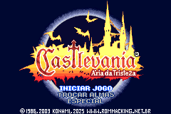 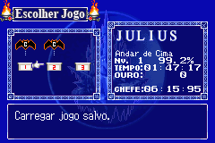 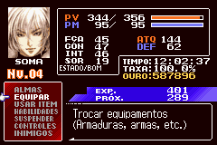

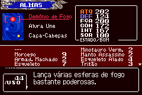 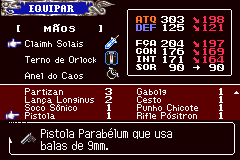 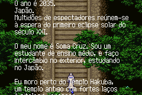

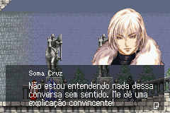 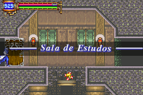 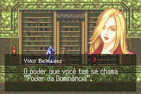

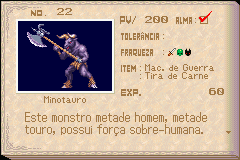 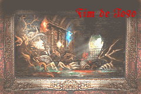 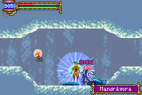

Versão Recolor:

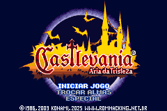 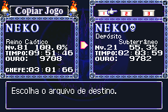 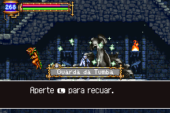

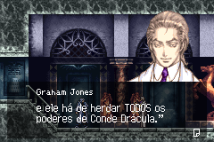 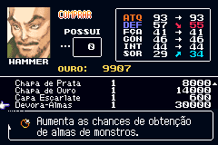 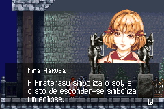

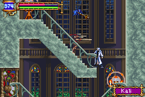 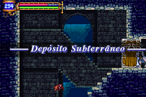 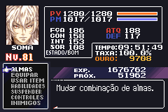

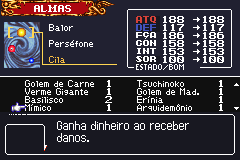 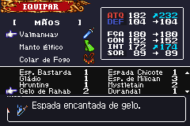 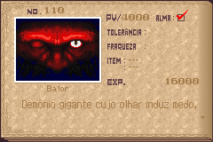

# Patch

O patch de tradução está disponível na seção de releases desse repositório. Está em formato IPS, e vocês podem aplicá-los através de programas como [Floating IPS](https://www.romhacking.net/utilities/1040/) ou similares.

Esta tradução pode ser aplicada na ROM "Castlevania - Aria of Sorrow (U) [!].gba", com CRC32 35536183.